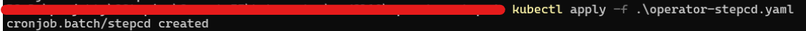
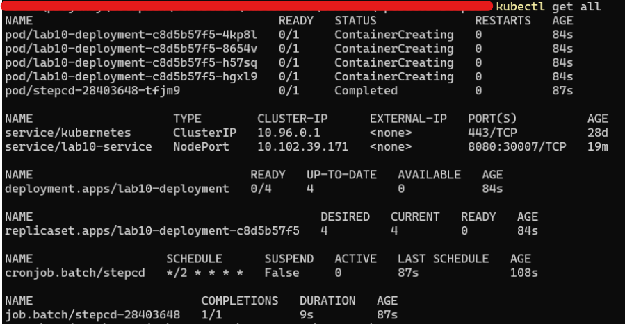
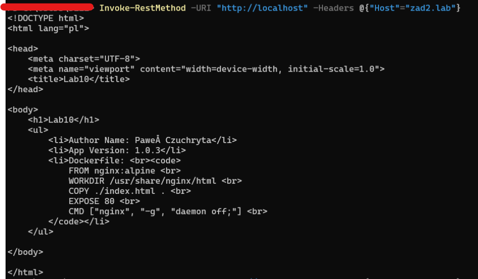
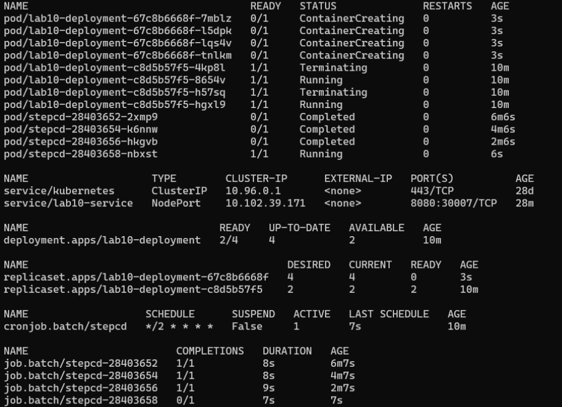
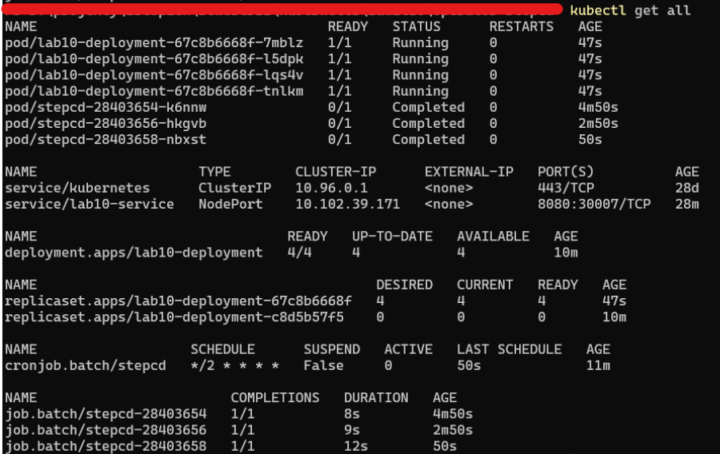
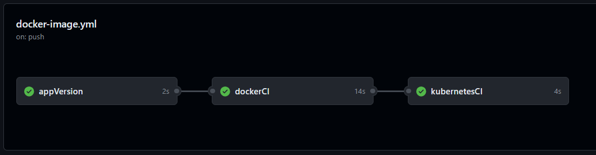
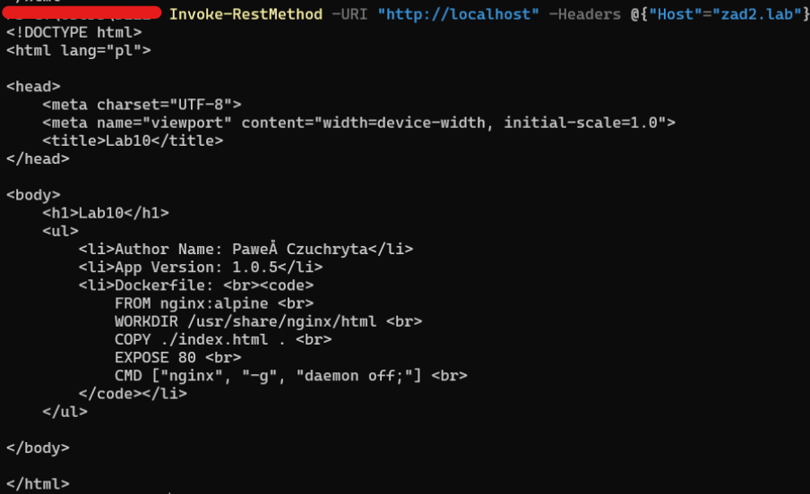

# Used repos
- https://github.com/Ybalath/lab10_source
- https://github.com/Ybalath/lab10_config

# 1A

## website source file
```html
<!DOCTYPE html>
<html lang="pl">

<head>
    <meta charset="UTF-8">
    <meta name="viewport" content="width=device-width, initial-scale=1.0">
    <title>Lab10</title>
</head>

<body>
    <h1>Lab10</h1>
    <ul>
        <li>Author Name: Paweł Czuchryta</li>
        <li>App Version: 1.0.5</li>
        <li>Dockerfile: <br><code>
            FROM nginx:alpine <br>
            WORKDIR /usr/share/nginx/html <br>
            COPY ./index.html . <br>
            EXPOSE 80 <br>
            CMD ["nginx", "-g", "daemon off;"] <br>
        </code></li>
    </ul>

</body>

</html>
```
## dockerfile
```dockerfile
FROM nginx:alpine 
WORKDIR /usr/share/nginx/html
COPY ./index.html .
EXPOSE 80
CMD ["nginx", "-g", "daemon off;"]
```

# 1B

## deployment config file
```yaml
apiVersion: apps/v1
kind: Deployment
metadata:
  name: lab10-deployment
spec:
  replicas: 4
  selector:
    matchLabels:
      app: lab10-app
  strategy:
    type: RollingUpdate
    rollingUpdate:
      maxSurge: 5
      maxUnavailable: 2
  template:
    metadata:
      labels:
        app: lab10-app
    spec:
      containers:
        - name: lab10-app
          image: ybalath/lab10-app:1.0.5
```

## ingress config file

```yaml
apiVersion: networking.k8s.io/v1
kind: Ingress
metadata:
  name: lab10-ingress
spec:
  rules:
  - host: zad2.lab
    http:
      paths:
      - pathType: Prefix
        path: "/"
        backend:
          service:
            name: lab10-service
            port:
              number: 8080
```

## service config file

```yaml
apiVersion: v1
kind: Service
metadata:
  name: lab10-service
spec:
  type: NodePort
  ports:
    - port: 8080
      targetPort: 80
      nodePort: 30007
  selector:
    app: lab10-app
```

# 2

## github workflow
```yaml
name: Docker Image CI

on:
  workflow_dispatch:
  push:
    branches: [ "master" ]
  pull_request:
    branches: [ "master" ]

jobs:

  appVersion:
    runs-on: ubuntu-latest
    outputs:
      version_number: ${{ steps.vars.outputs.version_number }}
    steps:
    - name: Check out the repo
      uses: actions/checkout@v4
      
    - name: set-output
      id: vars
      run: |
        version_number=$(sed -n 's/.*App Version: \(.*\)<\/li>/\1/p' index.html)
        echo "version_number=${version_number}" >> "$GITHUB_OUTPUT"
      shell: bash

        
  dockerCI:
    needs: appVersion
    runs-on: ubuntu-latest

    steps:
    - name: Check out the repo
      uses: actions/checkout@v4
    
    - name: Set up QEMU
      uses: docker/setup-qemu-action@v3
      
    - name: Set up Docker Buildx
      uses: docker/setup-buildx-action@v3
      
    - name: Login to Docker Hub
      uses: docker/login-action@v3
      with:
        username: ${{ secrets.DOCKER_HUB_LOGIN }}
        password: ${{ secrets.DOCKER_HUB_PASSWORD }}
    - name: Build and push
      uses: docker/build-push-action@v5
      with:
        context: .
        push: true
        tags: ybalath/lab10-app:${{ needs.appVersion.outputs.version_number}}
        
  kubernetesCI:
    needs: [appVersion, dockerCI]
    runs-on: ubuntu-latest

    steps:
      - name: Check out the repo
        uses: actions/checkout@v4
        with:
          repository: Ybalath/lab10_config
          token: ${{ secrets.ACTIONS_TOKEN }}
      - run: |
          sed -i 's/ybalath\/lab10-app:.*/ybalath\/lab10-app:${{ needs.appVersion.outputs.version_number }}/g' lab10-deployment.yaml
          git config user.name github-actions
          git config user.email github-actions@github.com
          git add -u
          git commit -m "updated app version ${{ needs.appVersion.outputs.version_number }}"
          git push
```
job appVersion is used to extract current app version from index.html to used in further steps

# 3A 
## lab10gitops

```dockerfile
FROM alpine:latest

RUN apk update && \
    apk add --no-cache git curl && \
    apk add --no-cache --repository=http://dl-cdn.alpinelinux.org/alpine/edge/community kubectl

CMD ["/bin/sh"]
```

# 3B

## StepCD cronjob manifest

```yaml
apiVersion: batch/v1
kind: CronJob
metadata:
  name: stepcd
spec:
  schedule: "*/2 * * * *"
  concurrencyPolicy: Forbid
  jobTemplate:
    spec:
      backoffLimit: 0
      template:
        spec:
          restartPolicy: Never
          serviceAccountName: gitops
          containers:
            - name: zad2gitops 
              image: ybalath/lab10gitops
              command: [sh, -e, -c]
              args:
                - git clone https://github.com/Ybalath/lab10_config.git /tmp/lab10_config && find /tmp/lab10_config -name '*.yaml' -exec kubectl apply -f {} \;
```
commands used to create gitops service account
```bash
kubectl create sa gitops
kubectl create clusterrolebinding gitops-admin --clusterrole=cluster-admin --serviceaccount default:gitops
```

# 4A

```bash
kubectl apply -f .\operator-stepcd.yaml
```




### Site before update


# 4B







### Site after ubdate


