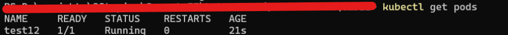

# lab12

## image creation

### dockerfile
```dockerfile
from nginx:latest
```

### bash/cmd commands 
```bash
 docker build -t ybalath/lab12:lab12 .
 docker push ybalath/lab12:lab12  
```

## container yaml file

```yaml
apiVersion: v1
kind: Pod
metadata:
  name: test12
spec:
  containers:
  - name: nginx-container
    image: ybalath/lab12:lab12
  imagePullSecrets:
  - name: dh-secret
```

## secret creation
```bash
kubectl create secret docker-registry dh-secret --docker-server=https://index.docker.io/v1
--docker-username=<USERNAME> 
--docker-password=<TOKEN>
```

## pod creation

```bash
kubectl apply -f pod.yaml
```



## pod description

```yaml
Name:             test12
Namespace:        default
Priority:         0
Service Account:  default
Node:             minikube/192.168.49.2
Start Time:       Fri, 19 Jan 2024 11:06:36 +0100
Labels:           <none>
Annotations:      cni.projectcalico.org/containerID: 04afd62559eb8753dbd3dc0cf1926742570758a6d38752b112080384b2b647cf
                  cni.projectcalico.org/podIP: 10.244.120.119/32
                  cni.projectcalico.org/podIPs: 10.244.120.119/32
Status:           Running
IP:               10.244.120.119
IPs:
  IP:  10.244.120.119
Containers:
  nginx-container:
    Container ID:   docker://bc3d4f8f8ab62c8dd3f394d651cb07640e14d145c6427c27050e0677404fa69f
    Image:          ybalath/lab12:lab12
    Image ID:       docker-pullable://********/lab12@sha256:**************************************************************
    Port:           <none>
    Host Port:      <none>
    State:          Running
      Started:      Fri, 19 Jan 2024 11:06:50 +0100
    Ready:          True
    Restart Count:  0
    Environment:    <none>
    Mounts:
      /var/run/secrets/kubernetes.io/serviceaccount from kube-api-access-h6qwb (ro)
Conditions:
  Type              Status
  Initialized       True 
  Ready             True 
  ContainersReady   True 
  PodScheduled      True 
Volumes:
  kube-api-access-h6qwb:
    Type:                    Projected (a volume that contains injected data from multiple sources)
    TokenExpirationSeconds:  3607
    ConfigMapName:           kube-root-ca.crt
    ConfigMapOptional:       <nil>
    DownwardAPI:             true
QoS Class:                   BestEffort
Node-Selectors:              <none>
Tolerations:                 node.kubernetes.io/not-ready:NoExecute op=Exists for 300s
                             node.kubernetes.io/unreachable:NoExecute op=Exists for 300s
Events:
  Type    Reason     Age   From               Message
  ----    ------     ----  ----               -------
  Normal  Scheduled  71s   default-scheduler  Successfully assigned default/test12 to minikube
  Normal  Pulling    70s   kubelet            Pulling image "ybalath/lab12:lab12"
  Normal  Pulled     57s   kubelet            Successfully pulled image "ybalath/lab12:lab12" in 12.8607652s (12.8608041s including waiting)
  Normal  Created    57s   kubelet            Created container nginx-container
  Normal  Started    57s   kubelet            Started container nginx-container
```
