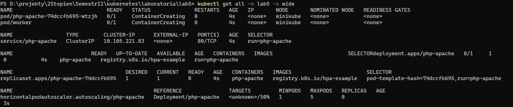
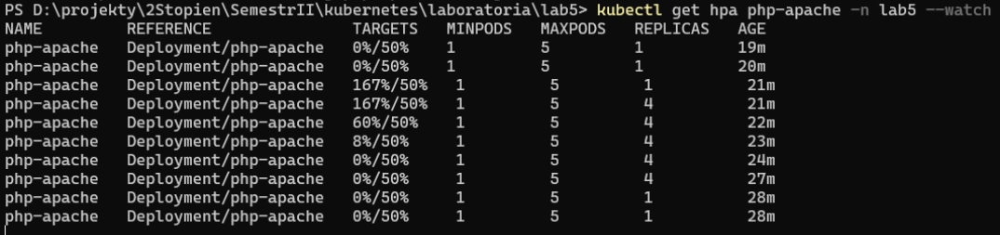

# yaml file

```yaml
apiVersion: v1
kind: Namespace
metadata:
  creationTimestamp: null
  name: lab5
spec: {}
status: {}

---

apiVersion: v1
kind: ResourceQuota
metadata:
  creationTimestamp: null
  name: lab5quota
  namespace: lab5
spec:
  hard:
    cpu: "2000"
    memory: 1.5Gi
    pods: "10"
status: {}


---

apiVersion: v1
kind: Pod
metadata:
  name: worker
  namespace: lab5
spec:
  containers:
  - name: worker
    image: nginx
    resources:
      limits:
        memory: "200Mi"
        cpu: "200m"
      requests:
        memory: "100Mi"
        cpu: "100m"

---

apiVersion: apps/v1
kind: Deployment
metadata:
  name: php-apache
  namespace: lab5
spec:
  selector:
    matchLabels:
      run: php-apache
  template:
    metadata:
      labels:
        run: php-apache
    spec:
      containers:
      - name: php-apache
        image: registry.k8s.io/hpa-example
        ports:
        - containerPort: 80
        resources:
          limits:
            memory: 250Mi
            cpu: 250m
          requests:
            memory: 150Mi
            cpu: 150m

---

apiVersion: v1
kind: Service
metadata:
  name: php-apache
  labels:
    run: php-apache
  namespace: lab5
spec:
  ports:
  - port: 80
  selector:
    run: php-apache

---

apiVersion: autoscaling/v2
kind: HorizontalPodAutoscaler
metadata:
  name: php-apache
  namespace: lab5
spec:
  scaleTargetRef:
    apiVersion: apps/v1
    kind: Deployment
    name: php-apache
  minReplicas: 1
  maxReplicas: 5
  metrics:
  - type: Resource
    resource:
      name: cpu
      target:
        type: Utilization
        averageUtilization: 50
status:
  observedGeneration: 1
  currentReplicas: 1
  desiredReplicas: 1
  currentMetrics:
  - type: Resource
    resource:
      name: cpu
      current:
        averageUtilization: 0
        averageValue: 0
```

# Resource cretion

```bash
kubectl apply -f .\lab5.yaml
```


# Check if everything starrted correctly

```bash
kubectl get all -n lab5 -o wide
```





# Incresing resource usage to trigger autoscaling

```bash
kubectl run -i --tty load-generator --rm --image=busybox:1.28 --restart=Never -- /bin/sh -c "while sleep 0.01; do wget -q -O- http://php-apache.lab5.svc.cluster.local; done"
```
Autoscaler observation during test



# Configuration checkup of created resources

```bash
kubectl describe namespace lab5 > dsc_namespace.yaml

kubectl describe resourcequotas lab5quota -n lab5  > dsc_resourcequota.yaml

kubectl describe deployments php-apache -n lab5  > dsc_deployment.yaml

kubectl describe pods -n lab5  > dsc_pods.yaml

kubectl describe horizontalpodautoscalers.autoscaling -n lab5 > dsc_hpa.yaml

```

